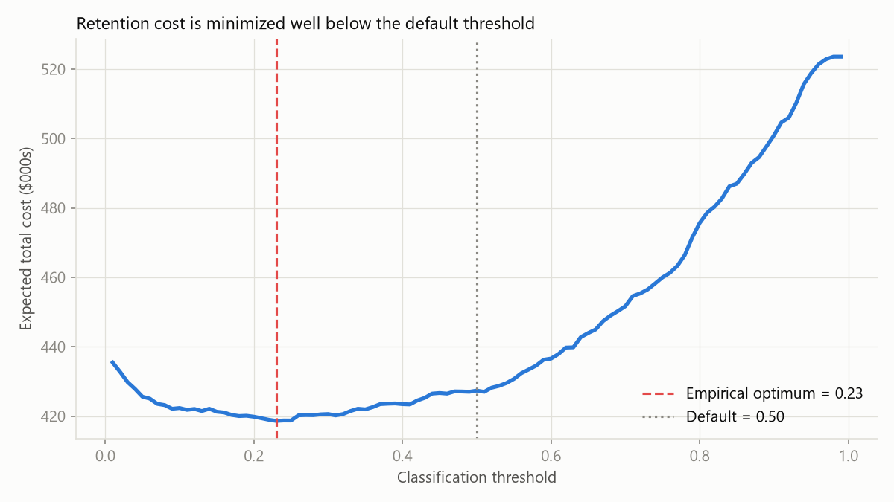
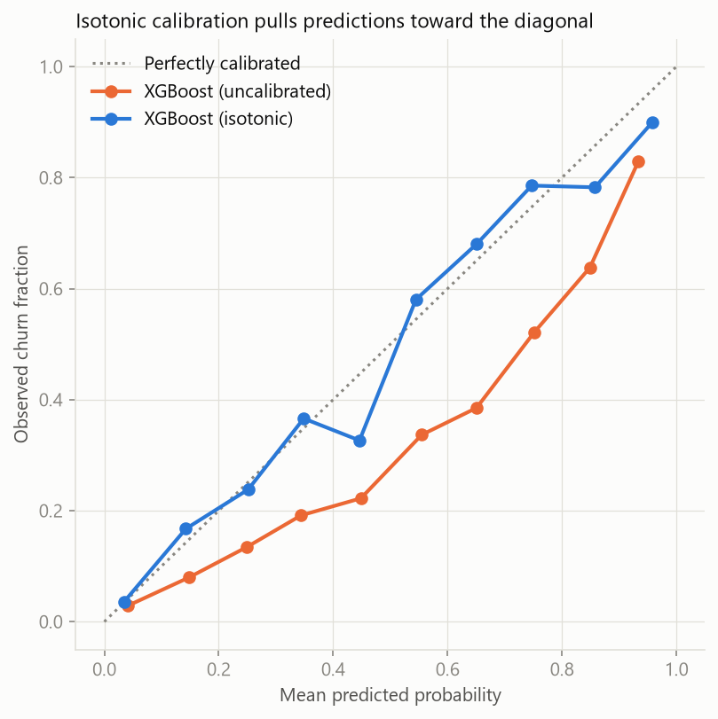
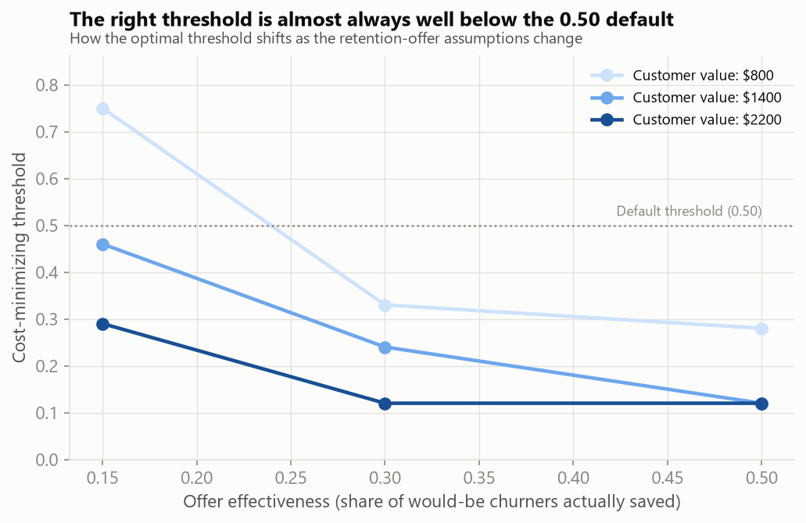
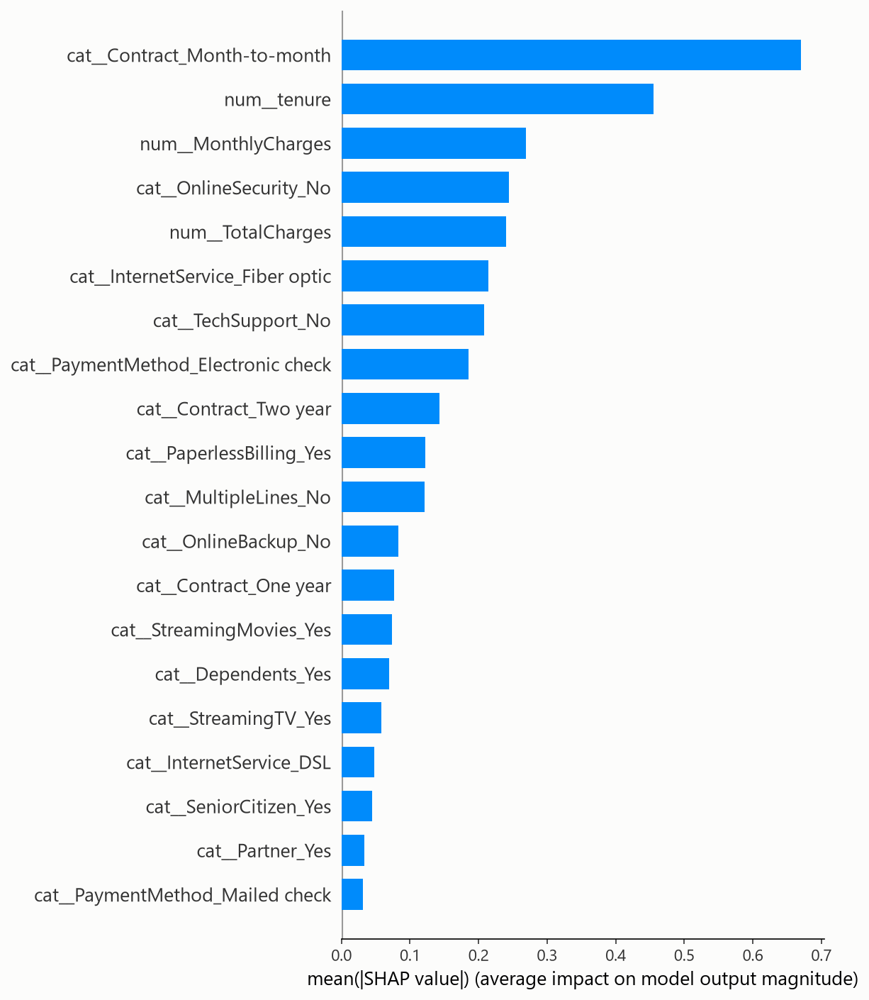

# Customer Churn Prediction with Cost-Optimized Intervention

Predicting telecom customer churn on 7,043 accounts, and — more importantly —
determining *which* customers are worth intervening on given real retention
economics.

Most churn projects stop at "I got 84% ROC-AUC." That's a tutorial completion,
not an analysis. This one uses the right metrics for a 26.5%-base-rate problem,
explains the model with SHAP instead of just scoring it, audits whether its own
predicted probabilities can be trusted, and optimizes the classification
threshold against actual retention economics instead of defaulting to 0.5.

## Key results

| Model | CV ROC-AUC | Test ROC-AUC | Recall (churn) | Precision (churn) |
|---|---|---|---|---|
| Predict-majority baseline | 0.500 | 0.500 | 0.00 | — |
| Logistic regression | — | 0.842 | 0.79 | 0.51 |
| XGBoost (tuned) | 0.846 | 0.843 | 0.79 | 0.52 |

**Tuned XGBoost beats logistic regression by 0.001 AUC — noise, not signal.**
For a retention team that needs to explain every individual offer, that gap
doesn't justify the interpretability cost. Logistic regression is the model
actually recommended for production; XGBoost is kept for SHAP-based feature
discovery, where its interaction terms surface a slightly richer ranking (see
below).

**Headline finding:** the cost-minimizing classification threshold is **0.12**
on calibrated probabilities — not the default 0.50. Operating there instead of
at 0.50 reduces expected retention cost by **$27.61 per customer**, or
**~$1.38M annually** at a 50,000-customer base.



## The threshold, derived three ways

A churn model outputs a probability. Turning it into an action requires a
threshold, and 0.5 is an artifact of the sigmoid, not a business decision. The
right threshold depends on what each kind of mistake costs.

**Retention campaign economics assumed:**

| Parameter | Value | Meaning |
|---|---|---|
| `OFFER_COST` | $50 | Cost of extending a retention offer |
| `LTV` | $1,400 | Customer lifetime value lost if they churn |
| `EFFECTIVENESS` | 0.30 | Fraction of would-be churners the offer actually saves |

**1. Analytically.** Intervene when `p × EFFECTIVENESS × LTV > OFFER_COST`, i.e.
`p > OFFER_COST / (EFFECTIVENESS × LTV) = 50 / (0.30 × 1400) ≈ 0.119`.

**2. Empirically**, by sweeping the threshold against the confusion matrix and
the per-outcome cost — on the *uncalibrated* XGBoost model, this landed at
**0.24**, noticeably above the analytical prediction. That gap turned out to be
real, not noise, and is resolved in step 3.

**3. After a calibration audit.** Boosted trees trained with
`scale_pos_weight` are notoriously miscalibrated — a customer scored at 0.30
does not necessarily churn 30% of the time — so the entire cost analysis rests
on an assumption worth checking rather than trusting. Isotonic calibration
improved Brier score from **0.163 → 0.136**, and on the calibrated
probabilities the empirical optimum shifted to **0.12** — essentially exactly
the analytical value. **The 0.24-vs-0.12 gap was a calibration artifact, not a
real economic effect**, and the audit is what tells the two apart instead of
leaving it unexplained.



The model shipped in `models/churn_model.joblib` is the calibrated one,
operating at threshold 0.12 — the threshold is saved *inside* the artifact
alongside the model, because it's part of the deployed decision, not a
notebook variable.

### Sensitivity analysis

The three cost parameters above are assumptions. Sweeping them shows how much
the recommendation depends on getting them exactly right (rows = offer
effectiveness, columns = LTV, cells = optimal threshold):

| Effectiveness | LTV $800 | LTV $1,400 | LTV $2,200 |
|---|---|---|---|
| 0.15 | 0.75 | 0.46 | 0.29 |
| 0.30 | 0.33 | **0.24** | 0.12 |
| 0.50 | 0.28 | 0.12 | 0.12 |

**Honest reading:** the optimal threshold is *not* uniformly low. At weak
offers (15% effective) combined with low customer value ($800 LTV), the
cost-minimizing threshold rises to 0.75 — close to never intervening, because
a cheap customer saved by a weak offer barely clears the cost of the offer
itself. The recommendation to move well below 0.5 holds for the
moderate-to-high effectiveness/LTV region that's plausible for this business
case, but it's conditional on that, not universal — which is what this table
is for.



## What drives churn (SHAP)



1. **Contract type dominates.** Being on a month-to-month contract carries the
   single largest mean |SHAP| contribution in the model — larger than any
   dollar figure — and month-to-month customers churn at **42.7%** versus
   **11.3%** (one-year) and **2.8%** (two-year) in the raw data — roughly 4x
   and 15x. Migrating even 10% of the month-to-month base to an annual
   contract via a discount incentive addresses the single largest identifiable
   risk pool.
2. **Risk concentrates in the first year.** Tenure ranks second. Churn falls
   from 52.9% in a customer's first six months to 9.5% after four years.
   Retention spend is more efficient front-loaded into onboarding than spread
   evenly across the base.
3. **Fiber optic is an independent risk factor** — it ranks *third*, ahead of
   both monthly and total charges, meaning simply being on fiber matters more
   to the model than the dollar amount on the bill. Fiber customers churn at
   **41.9%** versus **19.0%** for DSL, despite being the pricier tier. That's
   inconsistent with a purely price-driven story and points at a
   service-quality or expectation-setting problem. **The model can't answer
   why — the next step is pulling support-ticket and outage volume by service
   type.**

## Data quality note

`TotalCharges` ships as a string column with 11 blank values. All 11 have
`tenure == 0` — brand-new customers who haven't been billed yet. Their true
`TotalCharges` is 0, not missing, so they're imputed to 0 rather than dropped.
Dropping them would have removed exactly the zero-tenure segment, which is the
highest-churn segment in the dataset (52.9% in the first six months) — the
wrong rows to lose.

**A second data-cleaning bug, caught late.** `data.py` collapses redundant
categories (e.g. "No internet service" → "No") by checking
`df[col].dtype == object`. Pandas 3.0 changed the default dtype for string
columns from `object` to a new `str` dtype, which silently broke that check —
the collapse became a no-op, and every affected column carried extra,
functionally-duplicate one-hot categories that diluted their true SHAP
signal. Fixed by checking for either dtype. The practical effect: fiber optic
internet's true importance had been understated — after the fix it moved from
6th to 3rd in the SHAP ranking, ahead of both charge amounts (see below).

## Limitations and next steps

**Predicting who will churn is not the same question as predicting who to
target.** Some high-risk customers will leave regardless of any offer —
spending retention budget on them ("lost causes") is waste. Others would have
stayed quietly and churn *because* a retention email reminded them they have a
subscription to cancel ("sleeping dogs") — targeting them is actively harmful.
Risk ranking, which is everything above, cannot tell either group apart from a
genuine persuadable.

Telco has no randomized treatment variable, so a true uplift model can't be
fit on it honestly, and this project doesn't pretend otherwise. What would fix
it: a randomized holdout where a deliberately withheld fraction of high-risk
customers gets no offer, giving an uplift model (e.g. a two-model T-learner,
evaluated by Qini AUC) the treatment/control contrast it needs. Until that
data exists, the targeting rule here is honestly *risk-based*, not
*uplift-based* — the `EFFECTIVENESS` parameter in the cost model is this
project's explicit acknowledgment that not every intervention converts, even
though it can't yet say *which* customers would.

## Reproducing

Download the dataset from Kaggle ([`blastchar/telco-customer-churn`](https://www.kaggle.com/datasets/blastchar/telco-customer-churn))
and place `WA_Fn-UseC_-Telco-Customer-Churn.csv` in `data/raw/` — it's gitignored,
so it isn't in this repo.

```bash
python -m venv .venv
.venv\Scripts\activate          # Windows; source .venv/bin/activate on macOS/Linux
pip install -r requirements.txt

python -m src.data          # profile + clean, writes data/processed/telco_clean.csv
python -m src.eda           # 5 EDA figures -> reports/figures/
python -m src.train         # baseline + tuned XGBoost, threshold sweep -> models/, reports/
python -m src.explain       # SHAP figures + rankings -> reports/figures/, reports/shap_ranking.csv
python -m src.threshold     # cost curve + sensitivity analysis -> reports/figures/
python -m src.calibration   # calibration audit, writes the final models/churn_model.joblib

python -m pytest             # data-cleaning + cost-model regression tests
```

Or read the narrative version in `notebooks/` — each notebook imports the same
`src/` functions and is already executed with real output.

Built and tested against pandas 3.0.5 specifically — it's a very recent major
version, and `src/data.py` has a comment on a real bug that version introduced
(see the tests for the regression check).

## Repo structure

```
teleco-churn/
├── README.md
├── LICENSE
├── requirements.txt
├── pytest.ini
├── data/
│   ├── raw/                 # original CSV (gitignored)
│   └── processed/           # cleaned data, test split (gitignored, regenerated by scripts)
├── notebooks/
│   ├── 01_eda.ipynb
│   ├── 02_modeling.ipynb
│   └── 03_explainability_and_threshold.ipynb
├── src/
│   ├── data.py              # loading + cleaning
│   ├── features.py          # preprocessing pipeline
│   ├── model.py              # split, baseline + XGBoost training, evaluation
│   ├── evaluate.py          # cost model + threshold sweep
│   ├── eda.py                # EDA charts
│   ├── explain.py            # SHAP
│   ├── threshold.py          # threshold optimization + sensitivity analysis
│   ├── calibration.py        # probability calibration audit
│   ├── viz.py                 # shared chart styling + human-readable feature labels
│   └── train.py              # end-to-end training entry point
├── tests/
│   ├── conftest.py           # synthetic raw-schema fixture (doesn't need the real CSV)
│   ├── test_data.py          # cleaning logic, incl. a regression test for the pandas 3.0 bug
│   ├── test_evaluate.py      # cost-model math
│   └── test_features.py      # preprocessing pipeline
├── reports/
│   └── figures/              # exported PNGs (embedded above)
└── models/
    ├── churn_model.joblib          # production artifact: calibrated model + threshold
    ├── churn_model_xgb_raw.joblib  # uncalibrated model (used for SHAP's TreeExplainer)
    └── churn_model_logreg.joblib   # baseline
```

## What's not built yet

Two extensions from the original project plan are deliberately out of scope
for this version and are natural next steps: a FastAPI + Streamlit deployment
with live threshold sliders, and Kaplan-Meier / Cox survival analysis to
answer *when* a customer is likely to churn rather than just *whether*.
